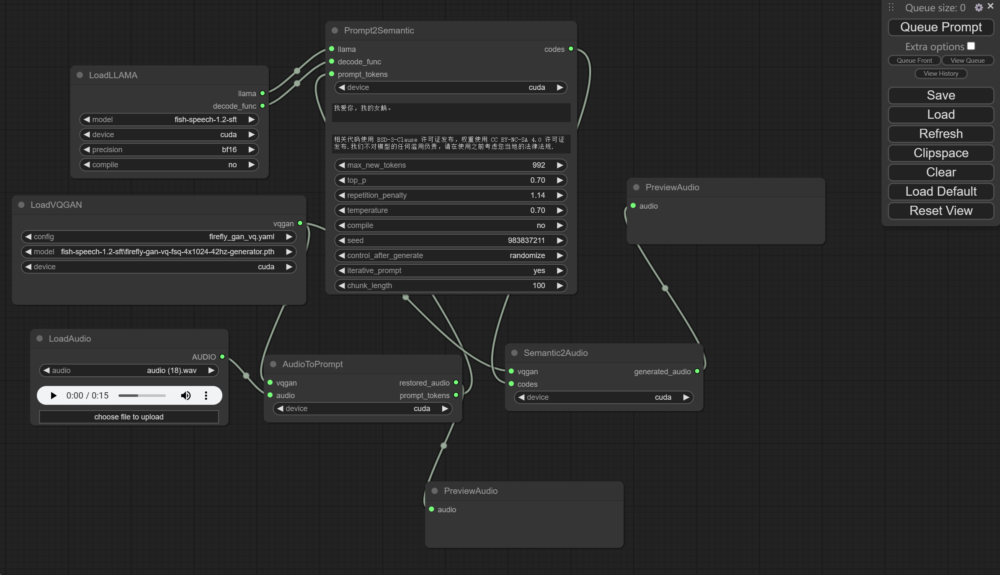
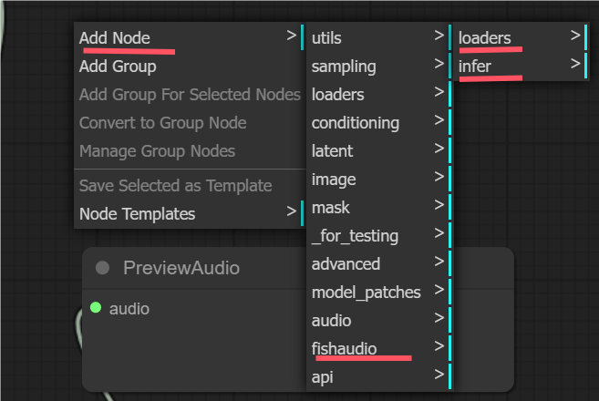

# ComfyUI-fish-speech
Official Implementation

## 安装 / Installation
### 1. Windows 整合包
1. 下载本项目后，直接将ComfyUI文件夹拖拽覆盖原来的ComfyUI文件夹即可。
2. 用这个命令进行环境安装: `.\python_embeded\python.exe -m pip install -r requirements.txt --no-warn-script-location`
3. 如需开启编译功能，需要安装fish-speech的官方环境。然后用其中的run_cmd.bat安装ComfyUI的环境，再运行ComfyUI\main.py.

## 示意图 / diagram

   

## 用法 / usage

   

